# Vision API Communication Schemas

This document groups the schemas that help explain the main Vision API flows.
Each diagram is generated from a Mermaid source file, which makes it easy to
edit as text and regenerate SVG and PNG previews.

## 1. Runtime overview



- Source: [`VISION_API_SCHEMA_1_RUNTIME_OVERVIEW.mmd`](./VISION_API_SCHEMA_1_RUNTIME_OVERVIEW.mmd)
- PNG preview: [`VISION_API_SCHEMA_1_RUNTIME_OVERVIEW.png`](./VISION_API_SCHEMA_1_RUNTIME_OVERVIEW.png)

This schema shows the main entry points of the API, requests from the debug
browser, external scripts, the camera page, then the shared state and model
engines the service uses in the background.

## 2. Detection stream lifecycle



- Source: [`VISION_API_SCHEMA_2_STREAM_DETECTION_FLOW.mmd`](./VISION_API_SCHEMA_2_STREAM_DETECTION_FLOW.mmd)
- PNG preview: [`VISION_API_SCHEMA_2_STREAM_DETECTION_FLOW.png`](./VISION_API_SCHEMA_2_STREAM_DETECTION_FLOW.png)

This schema describes stream creation, image and URL ingestion, detection under
the model lock, retained frames, WebSocket event publication, and any callbacks
when a stop condition triggers.

## 3. Camera code capture



- Source: [`VISION_API_SCHEMA_3_CAMERA_CAPTURE_FLOW.mmd`](./VISION_API_SCHEMA_3_CAMERA_CAPTURE_FLOW.mmd)
- PNG preview: [`VISION_API_SCHEMA_3_CAMERA_CAPTURE_FLOW.png`](./VISION_API_SCHEMA_3_CAMERA_CAPTURE_FLOW.png)

This schema shows how a camera code is created, served by the browser page,
then fed by JPEG captures from the client. Frames are retained, streams tied to
the code receive the same image, and read access uses the same retained
history.

## 4. Apply entry point and temporary outputs



- Source: [`VISION_API_SCHEMA_4_APPLY_AND_TEMP_OUTPUTS.mmd`](./VISION_API_SCHEMA_4_APPLY_AND_TEMP_OUTPUTS.mmd)
- PNG preview: [`VISION_API_SCHEMA_4_APPLY_AND_TEMP_OUTPUTS.png`](./VISION_API_SCHEMA_4_APPLY_AND_TEMP_OUTPUTS.png)

This schema details source selection for `/api/apply`, separation between
detection and depth models, and creation of reusable temporary outputs via
`/tmp/{token}`.

## Regeneration

From the repository root:

```bash
npx -y @mermaid-js/mermaid-cli -i docs/VISION/VISION_API_SCHEMA_1_RUNTIME_OVERVIEW.mmd -o docs/VISION/VISION_API_SCHEMA_1_RUNTIME_OVERVIEW.svg -b white
npx -y @mermaid-js/mermaid-cli -i docs/VISION/VISION_API_SCHEMA_1_RUNTIME_OVERVIEW.mmd -o docs/VISION/VISION_API_SCHEMA_1_RUNTIME_OVERVIEW.png -b white -w 1800

npx -y @mermaid-js/mermaid-cli -i docs/VISION/VISION_API_SCHEMA_2_STREAM_DETECTION_FLOW.mmd -o docs/VISION/VISION_API_SCHEMA_2_STREAM_DETECTION_FLOW.svg -b white
npx -y @mermaid-js/mermaid-cli -i docs/VISION/VISION_API_SCHEMA_2_STREAM_DETECTION_FLOW.mmd -o docs/VISION/VISION_API_SCHEMA_2_STREAM_DETECTION_FLOW.png -b white -w 1800

npx -y @mermaid-js/mermaid-cli -i docs/VISION/VISION_API_SCHEMA_3_CAMERA_CAPTURE_FLOW.mmd -o docs/VISION/VISION_API_SCHEMA_3_CAMERA_CAPTURE_FLOW.svg -b white
npx -y @mermaid-js/mermaid-cli -i docs/VISION/VISION_API_SCHEMA_3_CAMERA_CAPTURE_FLOW.mmd -o docs/VISION/VISION_API_SCHEMA_3_CAMERA_CAPTURE_FLOW.png -b white -w 1800

npx -y @mermaid-js/mermaid-cli -i docs/VISION/VISION_API_SCHEMA_4_APPLY_AND_TEMP_OUTPUTS.mmd -o docs/VISION/VISION_API_SCHEMA_4_APPLY_AND_TEMP_OUTPUTS.svg -b white
npx -y @mermaid-js/mermaid-cli -i docs/VISION/VISION_API_SCHEMA_4_APPLY_AND_TEMP_OUTPUTS.mmd -o docs/VISION/VISION_API_SCHEMA_4_APPLY_AND_TEMP_OUTPUTS.png -b white -w 1800
```
